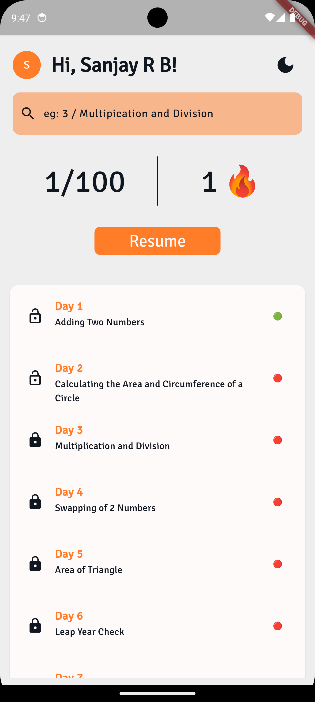
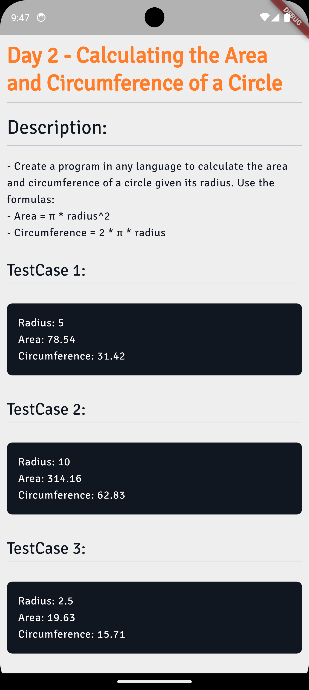
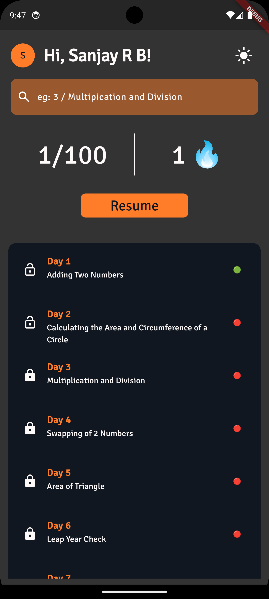
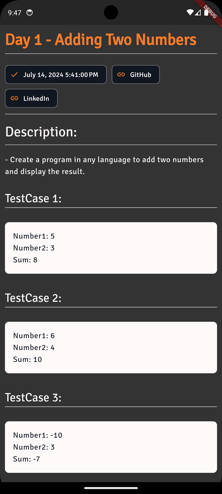
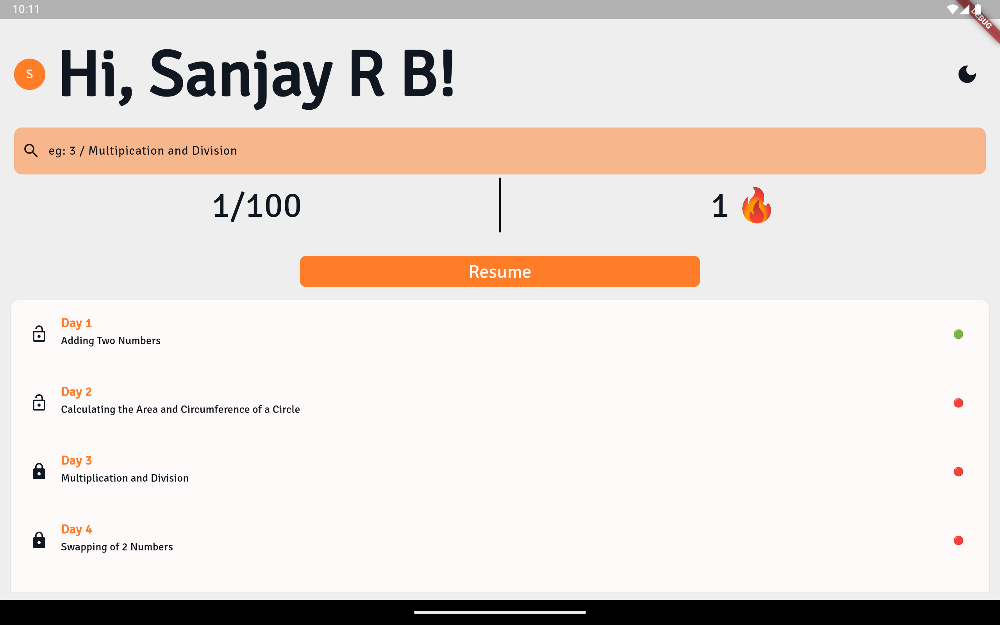
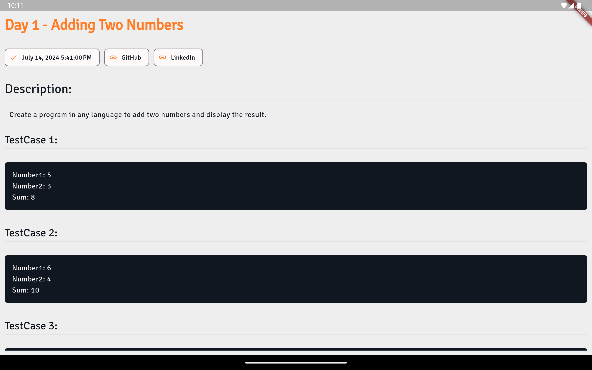
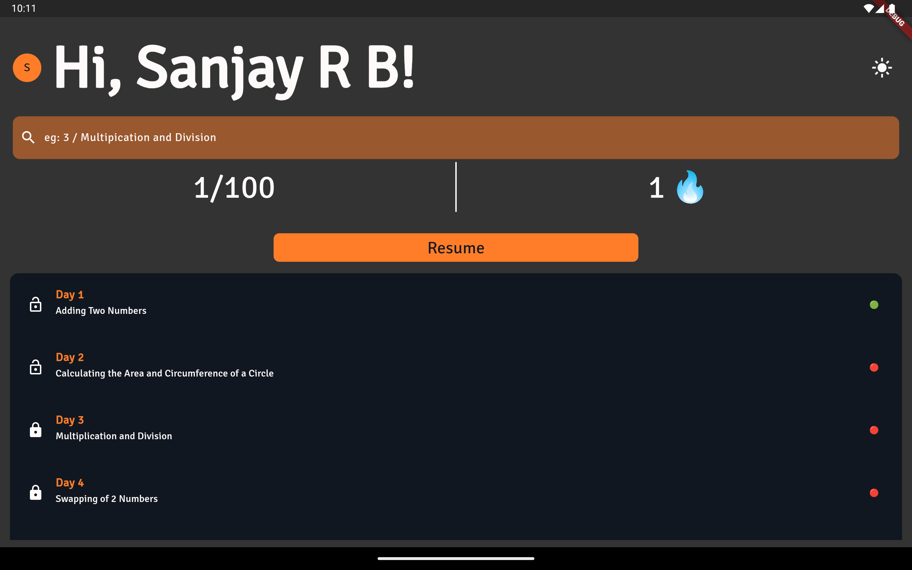
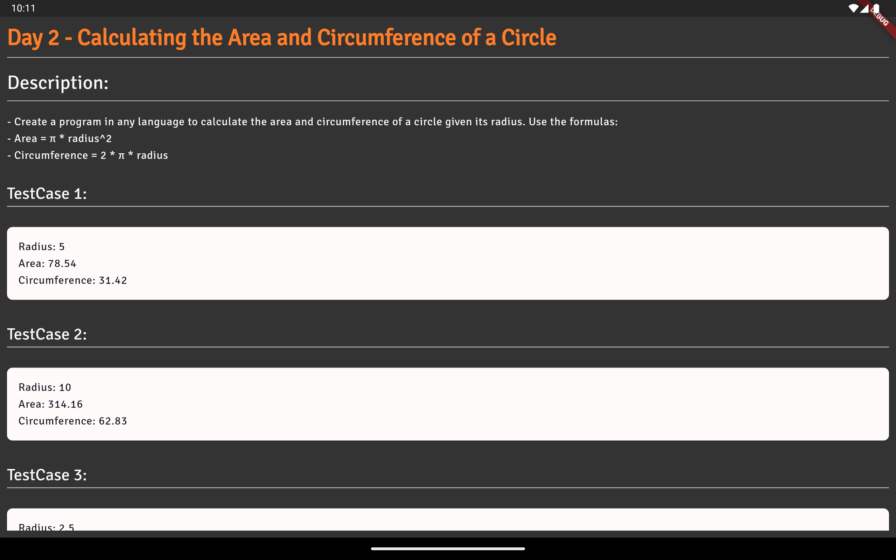

# 100 Days of Programming

## Description
Code 100 unique programs in any language over 100 days, track your progress with light/dark mode themes, and share your journey on GitHub and LinkedIn to maintain your streak and network with others! 🌞🌜📊🌟🤝📚

## Badges

## Table of Contents
- [Installation](#installation)
- [Specifications](#specifications)
- [Authors](#authors)
- [License](#license)
- [Privacy Policy](#privacy-policy)
- [Releases](#releases)

## Installation
Kindly refer to the following Google Play Store URL for app installation: [100 Days of Programming](https://play.google.com/store/apps/details?id=com.sanjoke.hundred_days_of_programming)

## Specifications
- 100 days, 100 unique programs to code in any language of your choice. 🖥️
- This app offers both light and dark mode themes. 🌞🌜
- Personalized tracking of task completion with submissions via GitHub and LinkedIn posts. 📊
- Maintain your streak and stand out. 🌟
- By sharing task completions, you can network on LinkedIn and document your progress on GitHub. 🤝📚

## Authors
Designed, developed, and published by [Sanjay RB](https://sanjay-rb.github.io)

## License
This project is licensed under the MIT License. See the [LICENSE](LICENSE) file for more details.

## Privacy Policy
For details regarding our privacy practices, please refer to our Privacy Policy available [PRIVACY_POLICY.md](PRIVACY_POLICY.md).

## Screenshots
### Mobile
     

### Tablet
  
 

## Releases
### Version: 1.0.0+1
- **Major**: Initial release. 🎉

### Version: 1.3.2+2
- **Minor**: Implemented in-app update functionality. 🚀
- **Minor**: Added privacy policy. 🔒
- **Minor**: Integrated assets service. 📂
- **Patch**: Resolved authentication issues. 🛠️
- **Patch**: Delete user issues. 🛠️

### Version: 1.4.0+3
- **Minor**: Added App Check functionality. ✅
- **Patch**: Fixed state management issues on the login page. 🔧